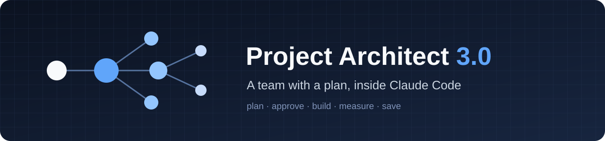
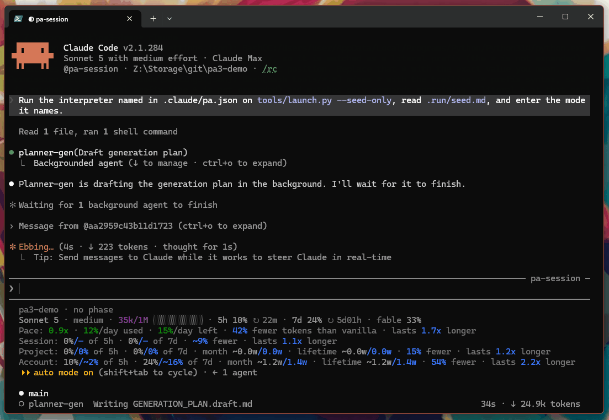
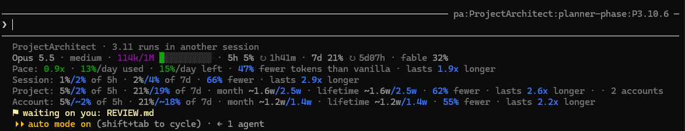
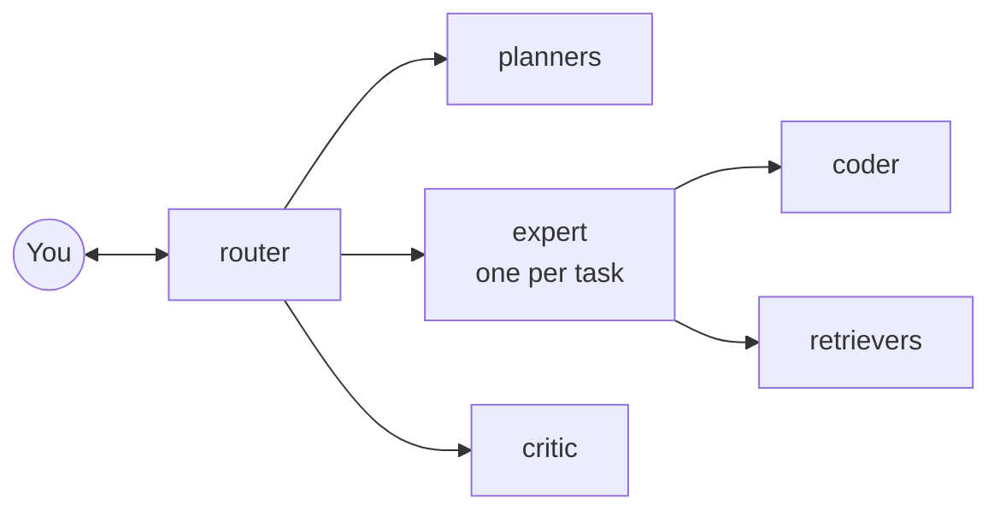

  

  
  
  

**Project Architect turns Claude Code into a small team that works from a plan.** It is a project management
system and a token-saving system in one. As a project manager, it keeps the plan: phases with a milestone a machine
can check, your approval before any work starts, and a memory in your repository that every new session starts from.
As a token saver, it runs each task in a small, fresh context, and helpers do the long reading and the build-and-test
loops, so your session never carries them; a local ledger measures what that saves, and the statusline shows it.
[What PA3 is and does](https://github.com/Druthulu/ProjectArchitect/wiki/What-PA3-does) explains every part in plain
words.

## What you get

- **A plan that outlives every session.** Phases with a milestone a machine can check, task summaries, decisions,
  rules and techniques, all kept as files in your repository. A new session starts from them, not from a transcript.
- **Work that runs on its own between two gates.** You approve the plan and confirm the close; in between, nobody
  stops to ask unless a decision is genuinely yours.
- **Savings you can see.** A local ledger prices every request, and the statusline shows, live, what the helpers kept
  out of your context.
- **Models that fit your plan.** Max 20x, Max 5x or Pro: PA3 reads which from your login and picks its models to
  match.

## See it

  

A new project from `claude` to the phase close, sped up: the router starts, the planners draft, you approve twice,
the experts brief a retriever and coders, and the phase closes.

  

White is what you used; blue is what the helpers saved. Here this session used 1 % of the five-hour window and its
helpers saved another 2 %, and over the project's life its work has gone 2.6 times as far as it would have without
them. [Every number, line by line](https://github.com/Druthulu/ProjectArchitect/wiki/Statusline-and-savings).

## Install

You need Claude Code, a Claude subscription (Max 20x, Max 5x or Pro), Python 3.12 or newer, and git.

1. **Once per machine.** Download this repository (**Code → Download ZIP**, then extract) and open its
   `project-architect-3.0` folder. On Windows, double-click **`install.cmd`**; on WSL, Linux or macOS, run
   `./install.sh`. It asks nothing.
2. **Once per repository.** Open the repository in Claude Code: PA3 shows one line that sets it up, with the path
   already filled in. Type it, then restart Claude Code (`/exit`, then `claude`). Or double-click
   **`setup-project.cmd`** and pick the folder. It makes one commit and never pushes.
3. **Start.** Open `claude` in your repository, and the router takes it from there. The first time, PA3 asks which day
   your plan renews (the Claude app shows it under Settings → Billing) so the month figures count from it.

Step by step, updating and removing: [Install](https://github.com/Druthulu/ProjectArchitect/wiki/Install). Every
switch: [INSTALL.md](project-architect-3.0/INSTALL.md).

## How it works

You talk to one session, the router. A planner drafts each phase; after you approve it, the router runs one expert
per task in a fresh context, the expert briefs coders and retrievers, and the critic judges any change to the plan.
The phase closes when its milestone check passes, with a plain-English recap of what was done.
[What PA3 is and does](https://github.com/Druthulu/ProjectArchitect/wiki/What-PA3-does) ·
[The roles](https://github.com/Druthulu/ProjectArchitect/wiki/How-it-works) ·
[A day in the life](https://github.com/Druthulu/ProjectArchitect/wiki/A-day-in-the-life)

## Why Project Architect

A long Claude Code session re-sends everything it has seen with every request: the files it read, the command
output, its own reasoning. The context keeps growing, and every later request pays for all of it again. Project
Architect changes the shape of the work:

- **Memory that carries forward.** Every session, and every expert inside one, starts from the files the work left
  behind (the plan, the task summaries, the decisions, the rules and techniques) instead of a long transcript.
  Nothing has to stay in context to be remembered.
- **Helpers that keep the weight off.** Retrievers read the long files and return one answer, coders run the edit,
  build and test loops, and each expert starts its task with a small, fresh context. What they read never lands in
  your session, and the statusline counts what that kept out.

| | Vanilla | Project Architect |
|---|---|---|
| Average context per request | 459k to 547k tokens | 47k to 69k tokens |
| Context when the work starts | 100k to 300k tokens | about 15k tokens |
| Cost per request, at API prices | $0.35 to $0.42 | $0.08 to $0.11 |

Vanilla: real projects worked in one long Claude Code session. Project Architect: its own first phases, measured the
same way. [The whole story, with the measurements](https://github.com/Druthulu/ProjectArchitect/wiki/History).

## Learn more

The [wiki](https://github.com/Druthulu/ProjectArchitect/wiki) has the rest: the
[statusline and the savings](https://github.com/Druthulu/ProjectArchitect/wiki/Statusline-and-savings),
[the bench](https://github.com/Druthulu/ProjectArchitect/wiki/Bench) that measures the agents themselves (results in
[`bench/results/`](bench/results/)), [why PA3 stays serial](https://github.com/Druthulu/ProjectArchitect/wiki/Speedups),
and the [FAQ](https://github.com/Druthulu/ProjectArchitect/wiki/FAQ). What changed in each release:
[CHANGES.md](project-architect-3.0/CHANGES.md).

## License

See [LICENSE](LICENSE).
